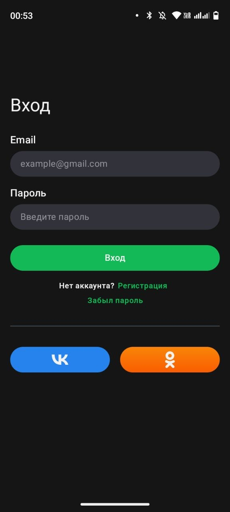
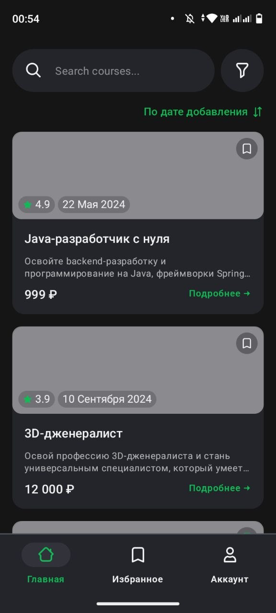

# Courses App (Test Task)

Android application for browsing courses.

## Screenshots

  
  

## Tech Stack
Kotlin, MVVM, Clean Architecture, Multi-module (app / data / domain),  
Hilt, Retrofit, Coroutines + Flow, AdapterDelegates, XML-based UI

## Features
- Login screen with email validation
- Courses list loaded from mock API
- Sorting by publish date (descending)
- BottomNavigation (Home / Favorites / Account)

## Not yet implemented
- Saving favorites to local database (Room)